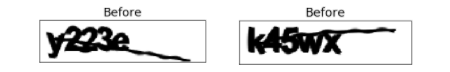
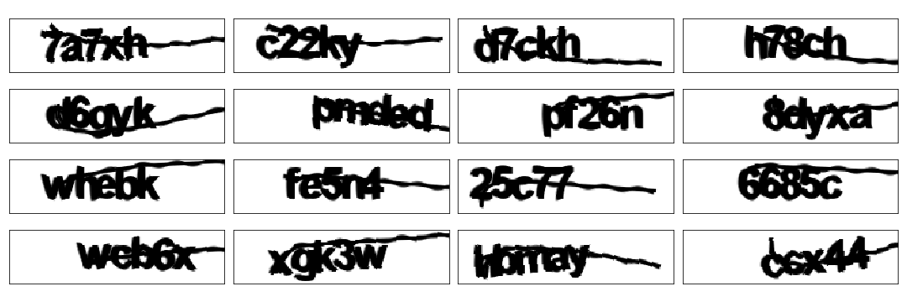
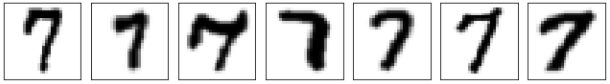
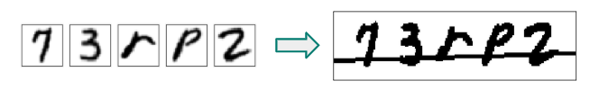
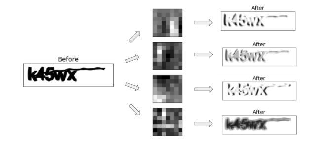
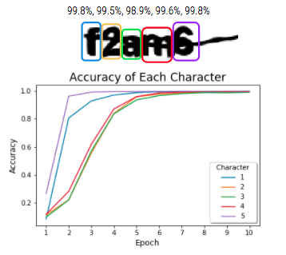
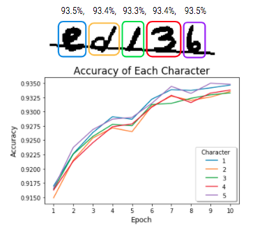
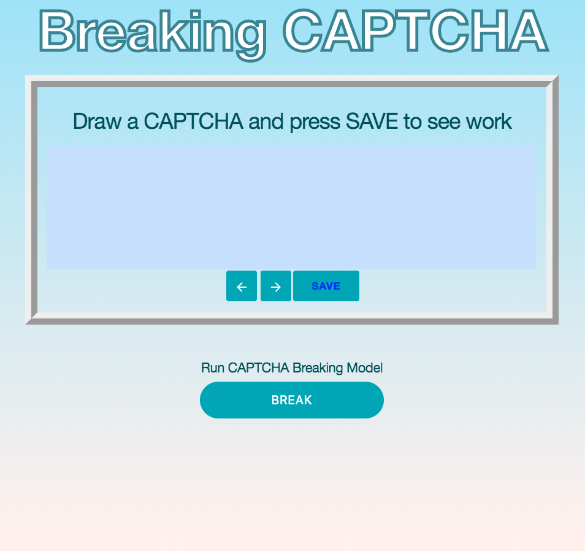
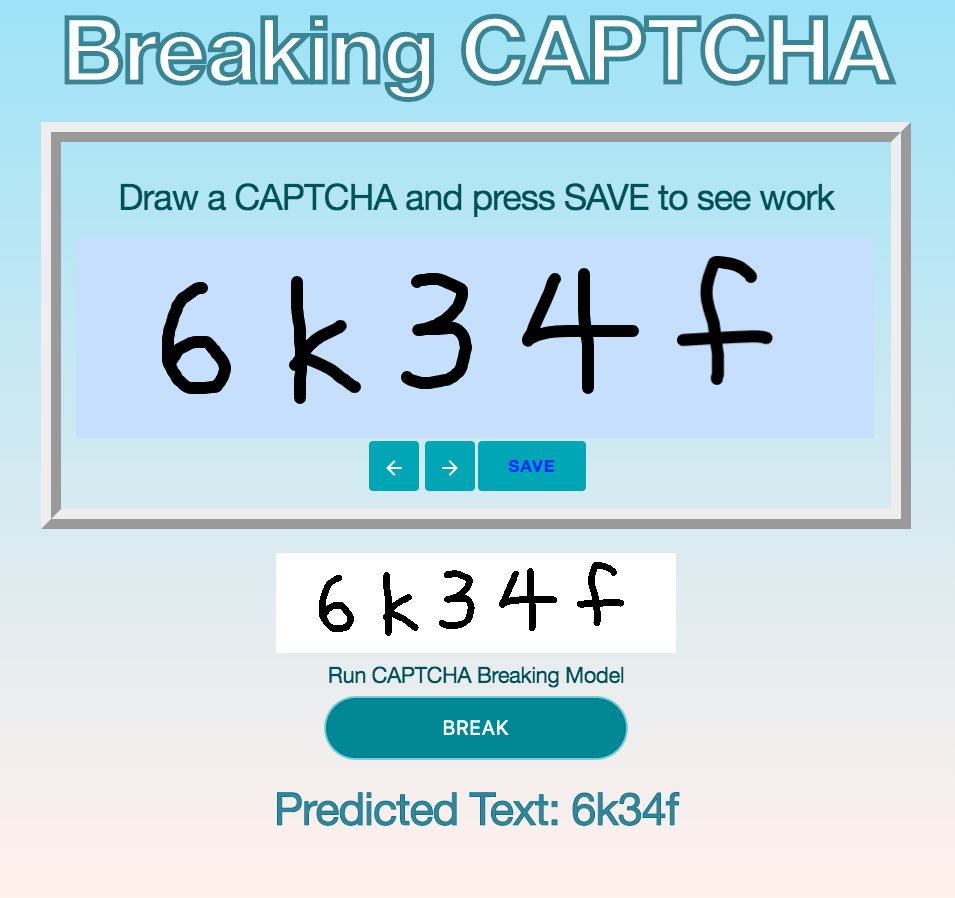
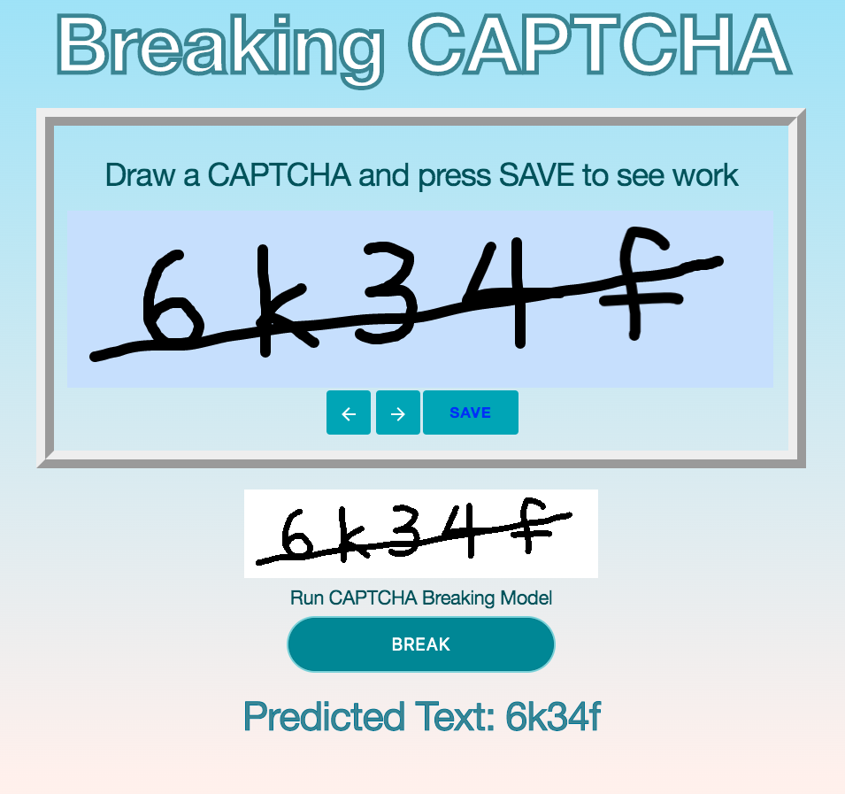

# Breaking CAPTCHA
**Ray Zhao**

* Have you ever been asked by a website if you are a robot? Been asked to read and type out a string of numbers and letters to prove that you aren’t? If yes, then you have then you’ve encountered CAPTCHA.

* To run web app, first clone this repo and install necessary packages then run 'python app.py' in terminal.

### Table of Contents

* [Background](#description)
* [Data](#data)
* [Model Structure](#model)
* [Results](#results)
* [Web App](#webapp)
* [Conclusion](#conclusion)

## Background

CAPTCHA is an acronym for Completely Automated Public Turing test to tell Computers and Humans Apart. It is used as a security measure for protecting websites from viruses or anything that may cause harm. Here are two examples of text-based CAPTCHA, the first one is from the dataset I will be using. So looking at that CAPTCHA, do you think it is possible to teach a machine how to read it?

## Data

#### CAPTCHA Data:
* This version of CAPTCHA data consists on 5 characters of either numbers or lowercase alphabetical letters with the same font.

* As you can see the placement of the characters seem to the be very similar, so to prevent the model from memorizing the location of each one I rotated and shifted the text.

#### Hand Drawn CAPTCHA Data:
* To also look at data where each character has a different font, what would be better than using handwritten numbers and letters.
* I used a dataset that contained over hundreds of thousands of different drawn numbers and letters to create new CAPTCHAs.
* The EMNIST dataset is an extension of the MNIST digits dataset that has alphabetical letters.

* I wrote a script that would concatenate 5 randomly selected characters then add line across them.
* This lead to the creation of over 1 million hand drawn CAPTCHAs images.

## Model Structure

### Visual
...add pic

* Once the data was collected, it was time build and train a model.
* The model I created was made up of 4 CNN layers and 5 individual dense layers for each character prediction output.  
* The model takes in the input image, runs it through a CNN and Max Pooling layer 4 times then the image data is flattened so that it can be sent through 5 separate dense and dropout layers to return a prediction of each character.

#### Why CNN?

* So why was the image run through 4 CNN layers?
* A CNN layer or Convolutional Neural Network is a Deep Learning algorithm which takes in an input image.
and runs it through a number of different filters, such as the 4 shown here.
* Then it assigns importances to various aspects in the image and which helps split the CAPTCHA into 5 characters.

## Results

#### CAPTCHA Data:

 

#### Hand Drawn CAPTCHA Data:

 

* For the original one font version of CAPTCHA, it had an average of 99% accuracy in its character predictions, but you can see that it has a harder time separating the characters seeing that there is almost a 1% difference for the 1st and 3rd. 
* As you can see in its graph, the first and last characters were identified the fastest, reaching 90% accuracy much earlier than the other characters.
* While on the other hand, the hand drawn CAPTCHA had an average 93% accuracy for each character which is lower due how each character did not look the same or have the same font. 
* The characters were more easily separated, there was only a 0.2% difference between 1st and 3rd character’s final accuracy.
* Although the accuracy for the first and last hand drawn characters are higher, you see that the accuracies for all characters increase at a similar pace.

## Web APP
* I then developed a web app where users can hand draw a CAPTCHA for the model to predict.
* Once you finish drawing you can press save to see what will be feed into the model and if you are satisfied
* Push BREAK for the model to return its prediction.

## Conclusion

In conclusion, building models to break CAPTCHA is very dependent on what CAPTCHA data you can acquire. Although each CAPTCHA instance is different, often times each kind of CAPTCHA still has similarities that can be picked up by a machine learning model. This leads to websites creating new versions of CAPTCHAs to combat people training models to predict CAPTCHAs. But since there will always be people trying to break CAPTCHA, website owners will have to adapt and switch to new versions of CAPTCHAS.

